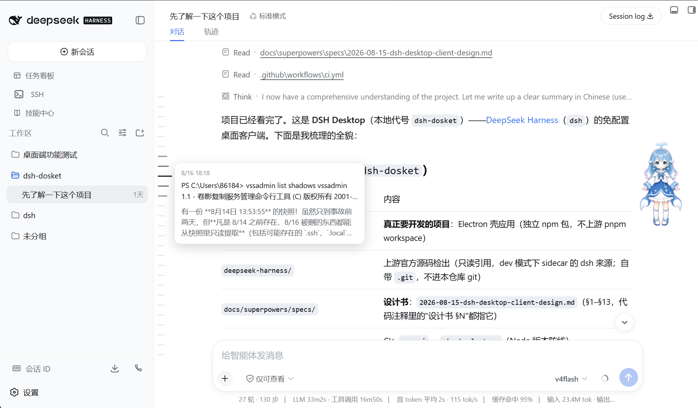

# dsh-plugin-atlas

[](https://www.npmjs.com/package/dsh-plugin-atlas)
[](./LICENSE)

为 dsh 提供三项能力：会话归档的管理（浏览、还原、可配置的自动归档）、对话区左侧一条用于轮次导航的刻度尺，以及输入框内以 `↑/↓` 翻找本会话已发送消息的输入历史。各项功能相互独立，可单独使用。

## 对话刻度尺

对话区左缘常驻一条纵向刻度尺，每轮对话（一条用户消息）对应一个刻度。刻度间距固定，不随会话长度变化：刻度较少时整列垂直居中，新增刻度自中部向两端延伸；超出可视高度后，刻度尺出现自带的细滚动条（支持滚轮与滑块拖动），不干预对话本身的滚动。打开会话时，整条历史的刻度由宿主端索引预先折叠、一次取回，不必把会话日志逐页载入对话视图；当前已加载的内容与新发言由实时快照补充合并，索引不可用或与快照对不上时回退为按快照建刻度并后台补齐全史。长会话切换与浏览不受其拖累。

鼠标进入刻度尺区域时，距指针最近的刻度伸长并加深，邻近刻度按距离递减伸缩，形成随指针连续移动的局部放大效果（Focus+Context 鱼眼交互）；指针离开后全部复位。点击刻度跳转至对应消息——目标位于尚未加载的历史分页时，将先行加载再滚动定位并短暂高亮；指针停留处显示该轮的用户输入与模型输出预览；`Alt+↑/↓` 可在轮次间逐条移动。配色取自宿主界面的主题变量，明暗主题下均可正常呈现。



## 输入历史

输入框内按 `↑`，本会话最近发送的一条消息即直接填入输入框，连按向更早翻找，`↓` 向新方向返回，走回起点时恢复翻找前的草稿——与终端里翻找历史命令的手感一致。编辑过内容后重新从头算起；只有当光标停在文本开头（按 `↑`）或末尾（按 `↓`）时才触发翻找，光标在正文中或存在选区时箭头照常移动光标，翻找途中则随时可用；输入法组词、命令菜单等场景不受影响。

## 归档管理

设置页提供一级分区「归档管理」：已归档会话按工作区分组展示，支持搜索过滤与批量选择，可逐条或批量取消归档。还原经由工作区注册表自身的写入路径完成，写入后所有已连接页面实时恢复侧边栏条目，无需重启。列表中的标题、最近输入与轮次数均取自会话日志本体。


自动归档为可选功能，默认关闭。支持配置「不活跃超过 N 天自动归档」与「每个工作区保留最近 M 条」两项规则，保存后每日核查一次；正式执行前可试运行，预览将被归档的会话清单后再行确认。

## 安装

```sh
dsh plugin --profile web add dsh-plugin-atlas
```

Web UI 的 设置 → 插件 里经 [dsh-plugin-install](https://github.com/qinyre/dsh-plugin-install) 按包名安装同理。亦可直接从 GitHub 仓库安装：

```sh
dsh plugin --profile web add github:qinyre/dsh-plugin-atlas
```

开发时可安装本地源码检出，包内 `prepare` 脚本会自动构建 `lib/`：

```sh
dsh plugin --profile web add file:/path/to/dsh-plugin-atlas
```

卸载：

```sh
dsh plugin --profile web remove dsh-plugin-atlas
```

## 安全与边界

写操作（取消归档、保存规则、执行自动归档）均要求同源 POST；规则数值设有范围校验；自动归档仅调用 dsh 公开的 `archiveSession` 接口，不读写私有状态。取消归档依赖注册表内部的状态写入函数——该路径在核心契约中已预留、尚未公开 RPC 化；若未来 dsh 的改动使其失效，插件将明确报错而非损坏数据，届时更新 dsh 与本插件即可。插件不删除任何会话或文件。

## 在 DSH Desktop 中

桌面客户端 [DSH Desktop](https://github.com/qinyre/dsh-Desktop) 内嵌同一 Web UI，本插件安装后即在桌面内生效，行为与独立 dsh 下完全一致；`DSH_HOME` 由桌面壳层统一管理。

## 开发

```sh
pnpm install
pnpm run typecheck
pnpm test
pnpm run build
```

端到端 smoke 默认关闭，要求同级目录下存在 [deepseek-harness](https://github.com/deepseek-ai/deepseek-harness) 源码检出，且 Node ≥ 22.19：

```sh
DSH_ATLAS_PLUGIN_SMOKE=1 pnpm test
```

它会创建临时 `DSH_HOME`，将本插件安装进 `web` profile，启动 `dsh web`，并对状态、列表、预览、取消归档、规则读写与 CSRF 防护逐一探测。

## 许可

[MIT](./LICENSE)
